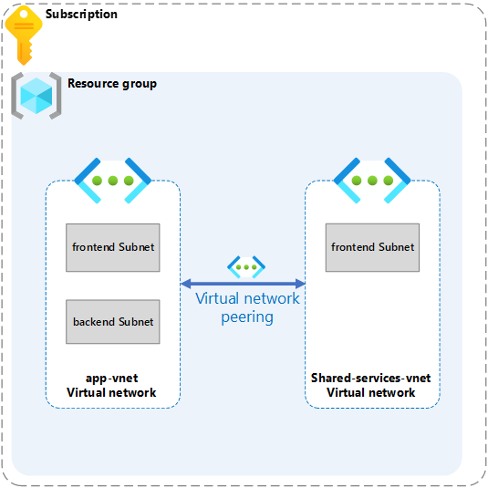

---
lab:
    title: 'Exercise: Provide network isolation and segmentation for the web application'
    module: 'Guided Project - Configure secure access to workloads with Azure virtual networking services'
---

# Lab: Provide network isolation and segmentation for the web application

## Scenario

The IT department needs network isolation and segmentation for the web application. To provide network isolation and segmentation for the web application, you need to create an Azure virtual network with subnets that the IT team provided. Once the virtual network is created, the next step is to configure virtual network peering. This allows the virtual networks to communicate with each other securely and privately.

### Architecture diagram

### Skilling tasks

- Create a virtual network
- Create a subnet
- Configure VNet peering

## Exercise instructions

Copilot can assist you in learning how to use the Azure scripting tools. Copilot can also assist in areas not covered in the lab or where you need more information. Open an Edge browser and choose Copilot (top right) or navigate to copilot.microsoft.com. Take a few minutes to try these prompts.
