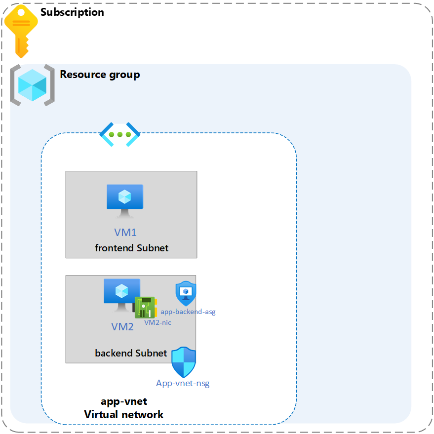

---
lab:
    title: 'Exercise: Control the network traffic to and from the web application'
    module: 'Guided Project - Configure secure access to workloads with Azure virtual networking services'
---

# Lab: Control the network traffic to and from the web application

## Scenario

Your organization requires control of the network traffic to and from the web application. To further enhance the security of the web application, network security groups (NSG) and application security groups (ASG) can be configured. NSG is a security layer that filters network traffic to and from Azure resources, while ASG allows grouping of resources to be managed collectively. These security groups provide fine-grained control over the network traffic to and from the web application components.

### Architecture diagram

### Skilling tasks

- Create an NSG.
- Create NSG rules.
- Associate an NSG to a subnet.
- Create and use Application Security Groups in NSG rules.

## Exercise instructions

Copilot can assist you in learning how to use the Azure scripting tools. Copilot can also assist in areas not covered in the lab or where you need more information. Open an Edge browser and choose Copilot (top right) or navigate to copilot.microsoft.com. Take a few minutes to try these prompts.
