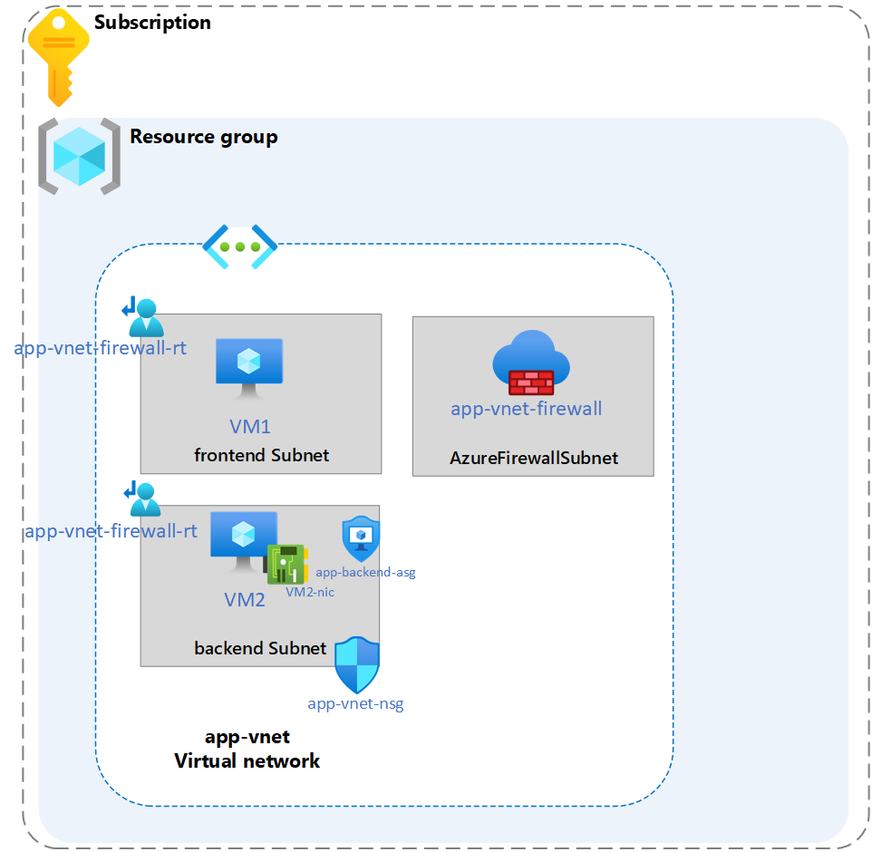

---
lab:
    title: 'Exercise: Protect the web application from malicious traffic and block unauthorized access'
    module: 'Guided Project - Configure secure access to workloads with Azure virtual networking services'
---

# Lab: Protect the web application from malicious traffic and block unauthorized access

## Scenario

Your organization is looking to protect the web application from malicious traffic and block unauthorized access.

In addition to NSG and ASG, a firewall can be configured to add an extra layer of security to the web application. A firewall protects the web application from malicious traffic and blocks unauthorized access with policies you configure.

Azure Firewall policy is a top-level resource that contains security and operational settings for Azure Firewall. It allows you to define a rule hierarchy and enforce compliance. In this task you configure application rules and network rules for the firewall using Firewall Policy. You can use Azure Firewall Policy to manage rule sets that the Azure Firewall uses to filter traffic.

### Architecture diagram

### Skilling tasks

- Create an Azure Firewall.
- Create and configure a firewall policy
- Create an application rule collection.
- Create a network rule collection.
  
## Exercise instructions

Copilot can assist you in learning how to use the Azure scripting tools. Copilot can also assist in areas not covered in the lab or where you need more information. Open an Edge browser and choose Copilot (top right) or navigate to copilot.microsoft.com. Take a few minutes to try these prompts.
