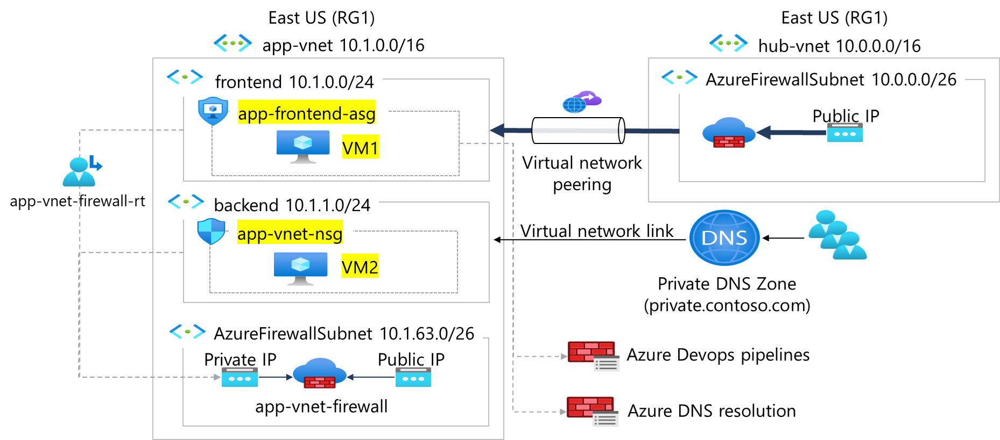

---
lab:
    title: 'Exercise 02: Create and configure network security groups'
    module: 'Guided Project - Configure secure access to workloads with Azure virtual networking services'
---

# Exercise 02: Create and configure network security groups

## Scenario

Your organization requires the network traffic in the app-vnet to be tightly controlled. You identify these requirements.
+ The frontend subnet has web servers that can be accessed from the internet. An **application security group** (ASG) is required for those servers. The ASG should be associated with any virtual machine interface that is part of the group. This will allow the web servers to be easily managed. 
+ An **NSG rule** is required to allow inbound HTTPS traffic to the ASG. This rule uses the TCP protocol on port 443. 
+ The backend subnet has database servers used by the frontend web servers. A **network security group** (NSG) is required to control this traffic. The NSG should be associated with any virtual machine interface that will be accessed by the web servers. 
+ An **NSG rule** is required to allow inbound network traffic from the ASG to the backend servers.  This rule uses the MS SQL service and port 1443. 
+ For testing, a virtual machine should be installed in the frontend subnet (VM1) and the backend subnet (VM2).  The IT group has provided an Azure resource manager template to deploy these **Ubuntu servers**. 

## Skilling tasks

+ Create a network security group.
+ Create network security group rules.
+ Associate a network security group to a subnet.
+ Create and use application security groups in network security group rules.

## Architecture diagram




## Exercise instructions

### Create the network infrastructure for the exercise

**Note:** This exercise requires the Lab 01 virtual networks and subnets to be installed. A [template](https://github.com/MicrosoftLearning/Configure-secure-access-to-workloads-with-Azure-virtual-networking-services/blob/main/Allfiles/Labs/All-Labs/create-vnet-subnets-template.json) is provided if you need to deploy those resources.

1. Use the icon (top right) to launch a **Cloud Shell** session. Alternately, navigate directly to `https://shell.azure.com`.

1. If prompted to select either **Bash** or **PowerShell**, select **PowerShell**.

1. Storage is not required for this task Select your subscription. 

1. Deploy the virtual machines required for this exercise. 

   ```powershell
   $RGName = "RG1"
   
   New-AzResourceGroupDeployment -ResourceGroupName $RGName -TemplateUri https://raw.githubusercontent.com/MicrosoftLearning/Configure-secure-access-to-workloads-with-Azure-virtual-networking-services/main/Instructions/Labs/azuredeploy.json
   ```
  
1. In the portal search for and select `virtual machines`. Verify both vm1 and vm2 are **Running**.

### Create Application Security Group

[Application security groups (ASGs)](https://learn.microsoft.com/azure/virtual-network/application-security-groups) let you group together servers with similar functions. For example, all the web servers hosting your application. 

1. In the portal, search for and select `Application security groups`.
   
1. Select **+ Create** and configure the application security group. 

    | Property       | Value                        |
    | :------------- | :--------------------------- |
    | Subscription   | **Select your subscription** |
    | Resource group | **RG1**                      |
    | Name           | `app-frontend-asg`          |
    | Region         | **East US**                  |

1. Select **Review + create** and then select **Create**.

**Note**: You are creating the application security group in the same region as the existing virtual network.

**Associate the application security group to the network interface of the VM**

1. In the Azure portal, search for and select `VM2`.

1. In the **Networking** blade, select **Application security groups** and then select **Add application security groups**.

1. Select the **app-frontend-asg** and then select **Add**.
   
### Create and Associate the Network Security Group

[Network security groups (NSGs)](https://learn.microsoft.com/azure/virtual-network/network-security-groups-overview) secure network traffic in a virtual network. 

1. In the portal search for and select `Network security group`.

1. Select **+ Create** and configure the network security group. 

    | Property       | Value                        |
    | :------------- | :--------------------------- |
    | Subscription   | **Select your subscription** |
    | Resource group | **RG1**                      |
    | Name           | `app-vnet-nsg`            |
    | Region         | **East US**                  |

1. Select **Review + create** and then select **Create**.

**Associate the NSG with the app-vnet backend subnet.**

NSGs can be associated with subnets and/or individual network interfaces attached to Azure virtual machines. 

1. Select **Go to resource** or navigate to the **app-vnet-nsg** resource.

1. In the **Settings** blade select **Subnets**.

1. Select **+ Associate**

1. Select **app-vnet (RG1)** and then the **Backend** subnet. Select **OK**.

### Create Network Security Group rules

An NSG use [security rules](https://learn.microsoft.com/azure/virtual-network/network-security-group-how-it-works) to filter inbound and outbound network traffic. 

1. In the search box at the top of the portal, enter **Network security groups**. Select Network security groups in the search results.

1. Select **app-vnet-nsg** from the list of network security groups.

1. In the **Settings** blade, select **Inbound security rules**.

1. Select **+ Add** and configure an inbound security rule. 

    | Property                               | Value                          |
    | :------------------------------------- | :----------------------------- |
    | Source                                 | **Any**                        |
    | Source port ranges                     | **\***                         |
    | Destination                            | **Application Security group** |
    | Destination application security group | **app-backend-asg**            |
    | Service                                | **SSH**                        |
    | Action                                 | **Allow**                      |
    | Priority                               | **100**                        |
    | Name                                   | **AllowSSH**                   |


### Learn more with online training

+ [Filter network traffic with a network security group using the Azure portal](https://learn.microsoft.com/training/modules/filter-network-traffic-network-security-group-using-azure-portal/). In this module, you focus on filtering network traffic using Network Security Groups (NSGs) in the Azure portal. Learn how to create, configure, and apply NSGs for improved network security.
+ [Secure and isolate access to Azure resources by using network security groups and service endpoints](https://learn.microsoft.com/training/modules/secure-and-isolate-with-nsg-and-service-endpoints/). In this module, you learn about network security groups and how to restrict network connectivity. 

### Key takeaways

Congratulations on completing the exercise. Here are the main takeaways:

+ Application security groups let you organize virtual machines and define network security policies based on your organization's applications.
+ An Azure network security group is used to filter network traffic between Azure resources in an Azure virtual network.
+ You can associate zero, or one, network security group to each virtual network subnet and network interface in a virtual machine. 
+ A network security group contains security rules that allow or deny inbound network traffic to, or outbound network traffic from, Azure resources.
+ You join virtual machines to an application security group. Then you use the application security group as a source or destination in the network security group rules.


