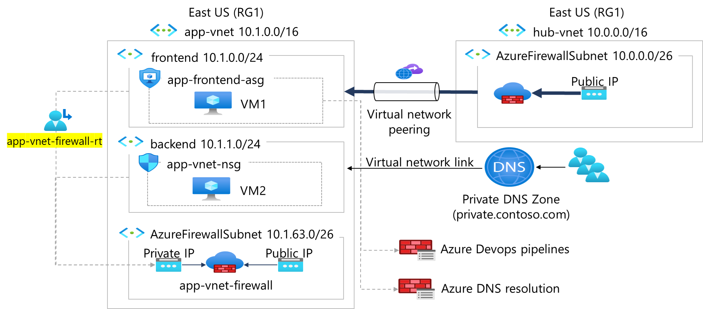

---
lab:
    title: 'Exercise: Operationalize and enforce policy to filter traffic'
    module: 'Guided Project - Configure secure access to workloads with Azure virtual networking services'
---

# Lab: Operationalize and enforce policy to filter traffic

## Scenario

Azure Firewall policy is a top-level resource that contains security and operational settings for Azure Firewall. It allows you to define a rule hierarchy and enforce compliance. In this task you configure application rules and network rules for the firewall using Firewall Policy. You can use Azure Firewall Policy to manage rule sets that the Azure Firewall uses to filter traffic.

### Architecture diagram

### Architecture diagram

### Skilling tasks

- Create and configure a firewall policy
- Create an application rule collection.
- Create a network rule collection.
  

## Exercise instructions

1.  Create an **application rule collection** in **fw-policy** that contains a single Target FQDN rule by using the values in the following table. For any property that is not specified, use the default value.

    |Property|	Value |
    |:---------|:---------|
    |Name	|**app-vnet-fw-rule-collection**|
    |Rule collection type| **Application**|
    |Priority|	**200**|
    |Rule collection action|**Allow**|
    |Rule collection group| **DefaultApplicationRuleCollectionGroup**|

1. Under **rules** use the values in the following table and select **Add** 

    |Property|  Value |
    |:---------|:---------|
    |Name	|**AllowAzurePipelines**|
    |Source type|**IP address**|
    |Source|**10.1.0.0/23**|
    |Protocol|**https** |
    |Destination type|FQDN|
    |Destination|**dev.azure.com, azure.microsoft.com**|

1.  Create a **network rule collection** that contains a single IP Address rule by using the values in the following table. For any property that is not specified, use the default value.

    |Property|	Value|
    |:---------|:---------|
    |Name|	**app-vnet-fw-nrc-dns**|
    |Rule collection type| **Network**|
    |Priority|	**200**|
    |Rule collection action|**Allow**|
    |Rule collection group| **DefaultNetworkRuleCollectionGroup**|

1. Under **rules** use the values in the following table and select **Add**    

    |Property|	Value|
    |:---------|:---------|
    |Rule |	**AllowDns**|
    |Source|	**10.1.0.0/23**|
    |Protocol|	**UDP**|
    |Destination ports|	**53**|
    |Destination addresses|	**1.1.1.1, 1.0.0.1**|

    Learn more on [creating an application rule](https://docs.microsoft.com/azure/firewall/tutorial-firewall-deploy-portal#configure-an-application-rule) and [creating a network rule](https://docs.microsoft.com/azure/firewall/tutorial-firewall-deploy-portal#configure-a-network-rule).

